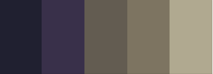

Horroreview-v2
---
A revised version of my Horror review website. After a while of updating the original site, I found that the code was becoming too complicated so I decided to give it a rework by using React to help make the code easier to read. By using React components I can make the code more readable and more flexible.

Color Palette
---
  
Darkest: #202030  
Darker: #39304a   
Dark: #635c51  
Light: #7d7461  
Lighter: #b0a990  

Tools && Technologies Used:
---

 
  

